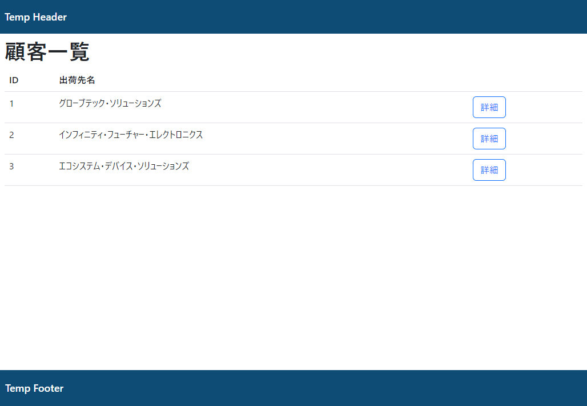

# 課題

顧客一覧画面作成

## 作成内容

1. サンプルプロジェクトの`customers`テーブルのEntityを作成してください。

2. サンプルプロジェクトの`customers`テーブルのRepositoryを作成してください。

3. サンプルプロジェクトの`customers`テーブルについて、以下のメソッドを持つサービスを作成してください。
   Serviceについては必ず、実装とインタフェースを分けて作成するようにしてください。
   * 全件取得

4. サンプルプロジェクトで`/customers`のURLに対応するControllerを作成してください。
   固定値で`list.html`のviewを返してください。
   (`list.html`は最低限のみ記述されたファイルとします。)

5. `home.html`に`/customers`のURLに遷移するリンクを配置してください。

6. viewのデザインを作成してください。
   viewには基礎となるlayouts.htmlを読みこむようにしてください。
   顧客情報(`customer`)の情報(ID,名前)をテーブルで表示し、各行の最後に詳細画面へのリンクボタンを作成してください。

6. ControllerでServiceを使用してviewに渡すデータを取得して下さい。
   `customer`は全件取得し、表示するものとします。
   (ページングは必要ありません。)

view例

