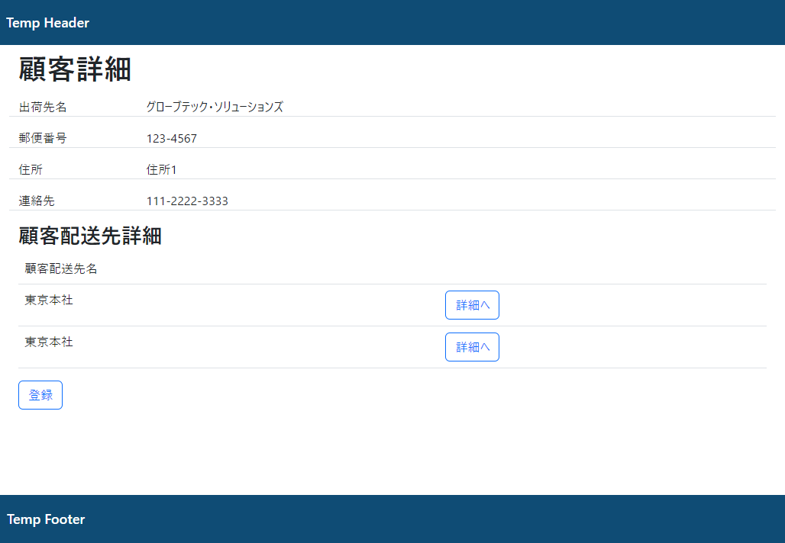

# 課題

詳細画面作成

## 作成内容

詳細画面作成のため、Controller,Viewを作成してください。
対応するURLは`/customer/{id}`としてください。
idの部分には一覧画面で選択したレコードのidが入ることとします。

顧客一覧画面を修正し、表示されている詳細ボタンから遷移できるようにしてください。

CustomerServiceとその実装に1件取得を行うメソッドを追加してください。

顧客配送先(`customer_destinations`)テーブルについてEntityを作成してください

`customer`とリレーションを構築してください。

詳細画面の作成を行ってください。
* 顧客
  詳細情報を表示してください。
  データの表示には`th:object`の属性を使用して作成してください。
  詳細情報の一番下に`編集`というボタンを配置してください(動作しない状態でかまいません。)

* 顧客配送先情報
  顧客情報に紐づく、顧客配送先情報を画面下部に一覧で表示してください。
  顧客配送先のには名前のみを表示し、最後に顧客配送先情報の詳細画面へのボタンを追加してください。
  (詳細画面へのボタンは配置のみで動作しなくてかまいません。)
  一覧したに顧客配送先情報の登録ボタンを用意してください。

view例

