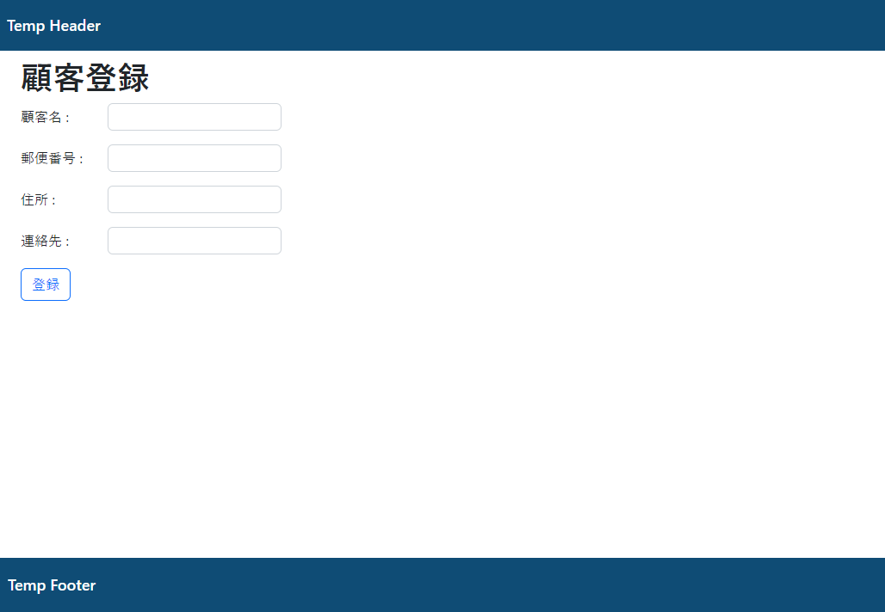

# 課題

顧客登録画面作成

## 作成内容

顧客情報の登録画面を作成してください。

* `home.html`に遷移のためのリンクを作成してください。

* 内容を入力するための画面を`customer/create`のURLのGETアクションで表示し
  `customer/create`のURLのPOSTアクションでデータの保存を行ってください。
  (Controllerのハンドラメソッドを2種類作成してください。)

* 入力内容について入力内容が適切か(バリデーション)を確かめて、
  間違っている場合はエラー文を表示するようにしてください。
    * 出荷先名
      -> 必須
    * 郵便番号
      -> 必須、半角数字半角ハイフンのみ
    * 住所
      -> 必須
    * 連絡先
      -> 必須、半角数字半角ハイフンのみ

* Serviceとその実装、Repositoryに1件保存用のメソッドを追加してください。

* 登録後は登録したデータの詳細画面へ遷移してください。

