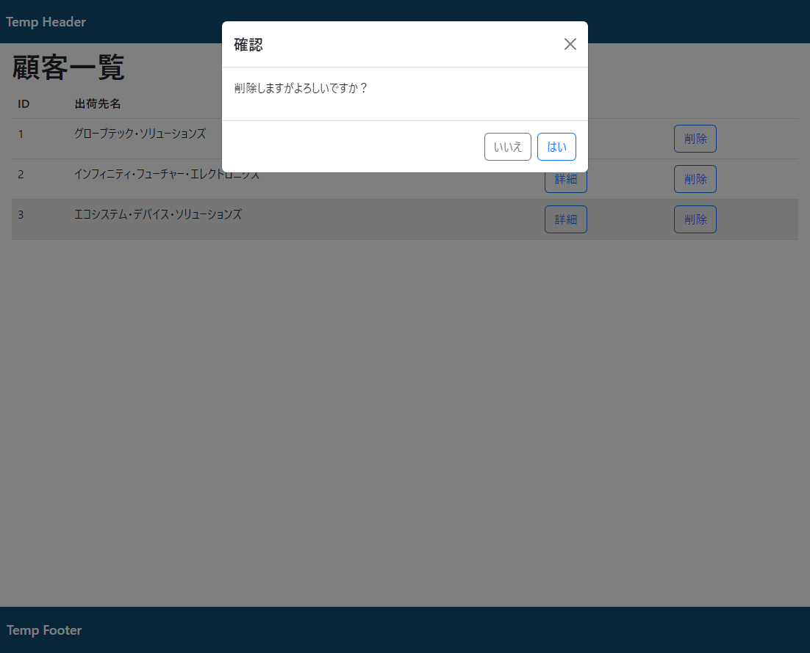
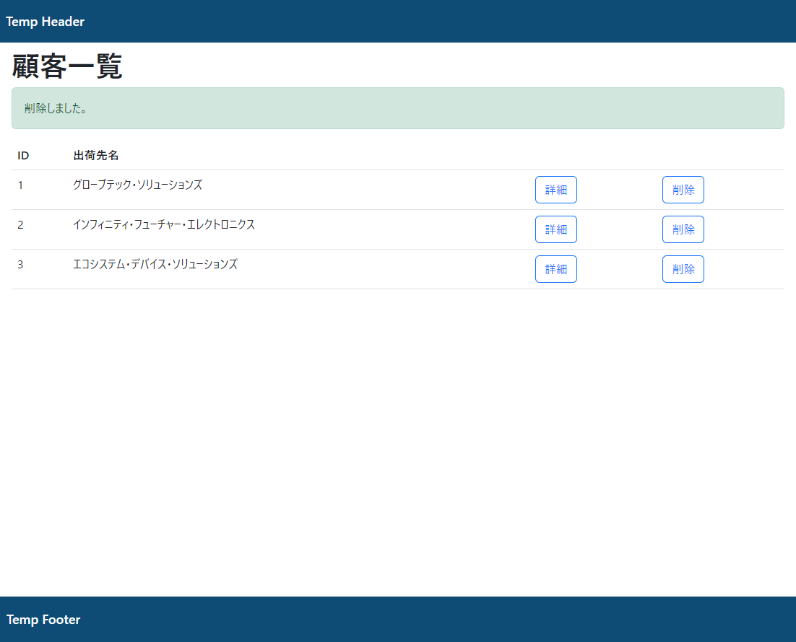

# 課題

削除機能の作成

## 作成内容

顧客情報の削除機能を作成してください。

* 削除ボタンは顧客情報の一覧画面のテーブルの最後尾に配置してください。

* 削除ボタンが押下された場合、確認モーダルを表示してください。
  選択肢として`はい`、`いいえ`を表示し`はい`を押下された場合、削除を行ってください。

  

* `customer/{id}/delete`のURLのPOSTアクションにて
  対象のIDの顧客情報(customer)の削除を行ってください。
  (顧客情報はDBから削除するものとします。)

* 削除した後に、一覧画面に遷移し、削除した旨のアラートを表示してください。

  

