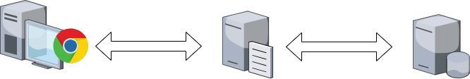
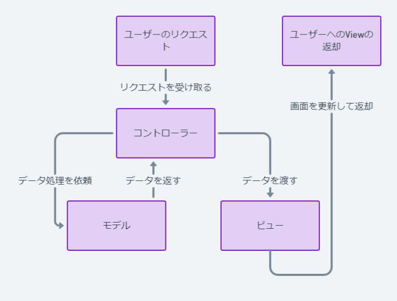
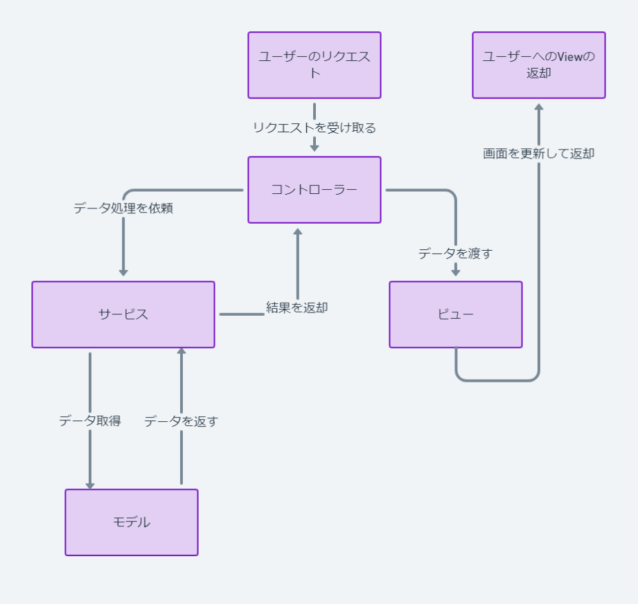

# 研修7日目

## WEBアプリケーションとは



Webシステムとはブラウザを使ってアクセスし、使用することができるソフトウェアです。

下記は一例ですが
WEBシステムにはJavaが動くWEB(AP)サーバーとMySQLが動くDBサーバーがあります。
システムの機能はWEBサーバーが実行し、データの保存や読み込みにはDBサーバを使います。

### WEBシステムの導線

WEBシステムが動くには、ユーザーからの操作が起点となります。

* ブラウザからのリクエスト
  ユーザーがブラウザにURLを入力し、Enterキーを押すか、リンクをクリックします。
  ブラウザはその操作に基づいてウェブサーバーにリクエスト(要求)を送ります。

* サーバーでの処理
  ユーザーからのリクエストはインターネットを通じてウェブサーバーに到達します。
  ウェブサーバーは静的コンテンツ(画像、HTMLファイルなど)を提供する役割を持っています。

  より複雑な処理やデータベースの問い合わせなどは、アプリケーションサーバーが担います。
  このサーバーはリクエストに基づいて動的にコンテンツを生成します。
  JavaのSpringFrameWorkはこのWEBサーバーとAPサーバーを担います。

* レスポンスの送信
  アプリケーションサーバーは処理を行い、その結果をウェブサーバーに送り返します。
  ウェブサーバーはこの結果をブラウザに返します。

* ブラウザでの表示
  ブラウザは受け取ったレスポンス（HTML、CSS、JavaScriptなど）を読み込み
  ユーザーに対してウェブページとして表示します。

### サンプルシステム

/srcの配下にサンプルプロジェクトがあります。
以降のサンプルのソースはサンプルプロジェクトから参照しています。

サンプルシステムの起動方法
フォルダを開くにて、src配下のサンプルプロジェクトを開き
vscodeの`Run or Debug`より`DemoApplication`を選びます。

その後緑の▶を押して起動します。

`http://localhost:8080`に接続するとサンプルプロジェクトにアクセスできます。

### WEBシステムがどうやってリクエストを処理するのか



ユーザーからのリクエストを受けた場合、SpringフレームワークはControllerからリクエストを処理するところから始まります。
ユーザーがブラウザやアプリを通じてサーバーに何らかの操作を求める際、HTTPメソッド(GET, POST, PUT, DELETEなど)の形で送られてきます。

* Controller
  Controllerクラスには、それぞれのURLとHTTPメソッドに対応するメソッドが実装されています。
  例えば、ユーザーがウェブページをGETリクエストする場合、Controller内のGETメソッドに対応するアクションが呼び出されます。
  Controllerはこのアクション内で、ユーザーのリクエストに応じた処理を行います。

  * 参考ソース
    `main/java/com/example/demo/lecture/web/user/controller/UserController.java`

    ```java
    @Controller
    public class UserController {
    ```
    `@Controller`というアノテーションを付けることで、SpringMVCではこのクラスがControllerであることを宣言しています。

    ```java
    @RequestMapping(path="/url",method=RequestMethod.GET)
    public String list(@PageableDefault(size = 10) Pageable pageable,Model model)
    ```
    これはクラスでのメソッド宣言です。
    URLに対応するアクションを決めるためハンドラメソッドと呼ばれます。

    path以降の部分でこのメソッドが対応を行うURLを決めます。
    URLにはHTTPメソッドごとに対応を決めることができ、それをmethod以降の部分で指定できます。

    メソッドの引数のPegeableについては、表のページングを実装するための組み込みクラスです。


* Model
  リクエストを処理する過程で、データの検索や更新、複雑なビジネスロジックが必要になった場合、ControllerはModelに処理を依頼します。
  Modelはデータベースとのやりとりを担い、データを取得・更新し、Controllerに返します。

  MVCモデルではデータベースのやり取りやビジネスロジックを全てまとめてモデルとして扱いますが
  それを少し拡張し、ビジネスロジックをServiceという名で切り出す事もあります。

  * 参考ソース
    `main/java/com/example/demo/lecture/web/user/controller/UserController.java`

    ```java
    public String list(@PageableDefault(size = 10) Pageable pageable,Model model) {
      var users = userService.findAll(pageable);
      model.addAttribute("users", users);
      return "pages/user/list";
    }
    ```
    `userService`がControllerクラスが保持しているモデル(Service)です。
    Serviceに対して、ユーザーの情報を取得するように依頼しています。

    `main/java/com/example/demo/lecture/service/UserService.java`
    `main/java/com/example/demo/lecture/service/Impl/UserServiceImpl.java`

    ```java
    @Service
    public class UserServiceImpl implements UserService {
    ```

    Serviceは使用するインターフェースと実装を行うクラスの2種類を作成することが多いです。
    (プロジェクトにより変わる可能性ももちろんあります)

    Serviceの実体になるクラス(`UserServiceImpl`)にはサービスクラスであることを示す`@Service`というアノテーションを付与します。
    このサービスのメソッドがControllerからの依頼の受け口となります。

    Serviceの中の実装にてDBにアクセスしていますが、詳しくは後述いたします。

* View
  ControllerはModelから受け取ったデータをもとに、どのように情報を表示するかを決めます。
  そして、最終的にユーザーに対して表示する画面を準備する役割を担うのがViewです。

  Viewは、ユーザーに返却するためのHTMLページを作成し、Modelからのデータを画面に組み込みます。
  作成されたHTMLページをユーザーに返却することでリクエストの処理が完了します。

  * 参考ソース
    `main/java/com/example/demo/lecture/web/user/controller/UserController.java`

    ```java
    public String list(@PageableDefault(size = 10) Pageable pageable,Model model) {
      var users = userService.findAll(pageable);
      model.addAttribute("users", users);
      return "pages/user/list";
    }
    ```

    `model`オブジェクトはControllerとViewの間でデータを橋渡しするオブジェクト(コンテナ)になります。
    `model.AddAttribute()`メソッドでデータを引き出すキー(`"users"`)と値(`users`)を登録しています。

    この`return`している文字列がControllerが返却するViewを指定する文字列になっています。
    (Viewのhtmlファイルを直接は指定しません。)
    SpringBootが文字列を自動で解釈し、実際のファイルを探して返却してくれます。
    これをViewの解決と呼びます。

    返却されているViewは
    `main/resources/templates/pages/user/list.html`になります。
    SpringBootがviewの解決を行う際`main/resources/templates`の配下のファイルを探します。

    その際に`"pages/user/`とディレクトリを指示することで、子ディレクトリのファイルを指定しています。

    `list.html`の中を見るとテンプレートエンジンにより
    Controllerから渡された情報を引き出しています。
    ```html
    <tr th:each="user : ${users}">
    ```

    SpringBootでよく使われるテンプレートエンジンはThymeLeafというエンジンです。
    詳しい使用方法については後述します。


上記をまとめると下記の図のような構成になります。



ビジネスロジックというのは
例で言うとオンラインショッピングサイトでの価格計算、割引の適用、在庫の管理など
単なるデータの取得だけでなくデータを加工することやどのデータを取得するなど
ロジックによる制御を伴うものを言います。


## SpringBootフレームワークとは

SpringFrameWorkは、堅牢なJavaアプリケーションを開発するためのサポートを提供する多機能なJavaフレームワークです。

中核となるのはSpring Coreというフレームワークです。
その中核では、DI(依存性注入)という機能とAOP(アスペクト指向プログラミング)という機能を簡単に出来るようにします。

DIはインスタンスの生成や依存関係の解決を自動で解決してくれるものになります。
AOPはログ記録やトランザクション管理などの横断的な関心事を分離するのに役に立ちます。

DIやAOPを使用可能にしたり判別するためにSpringではアノテーションを使用します。

* DI(依存性の注入)
  クラスの依存関係を自動的に管理するための基本的なデザインパターンです。
  DIとはオブジェクトのインスタンス化と依存関係の解決をユーザーから引き離し、専門のコンポーネントであるDIコンテナに委ねることです。
  今まで手動でnewしていたインスタンスをDIコンテナが自動で生成してくれるようになります。

  これによりDIコンテナはコードの保守性を向上させます。
  開発者はDIコンテナによって事前に構築されたインスタンスを使用することによって
  インスタンスの作成や依存関係管理の複雑な詳細について心配することなくビジネスロジックの実装などに集中できます。

  Spring Bootアプリケーションにおける依存性注入の動作例は以下です。

  以下の様にDIの元となるコンポーネント(Beansと呼びます)について
  DIコンテナは依存性の注入の際にコンテナの中に注入できる対象が存在するかコンポーネントスキャンを行います。
  そのためDIを利用するためにはDIコンテナに登録するためにアノテーションを付与します。
  例では`@Service`です。

  参考ソース:`main/java/com/example/demo/lecture/service/impl/UserServiceImpl.java`
  ```java
  import org.springframework.stereotype.Service;

  @Service
  public class UserServiceImpl
  ```

  Spring Bootでは、`@Autowired`のようなアノテーションを使ってクラスに自動的にbeansをワイヤリングするのが一般的です。

  参考ソース:`main/java/com/example/demo/lecture/web/user/UserController.java`
  ```java
  import org.springframework.beans.factory.annotation.Autowired;
  import org.springframework.stereotype.Controller;
  import com.example.demo.lecture.service.UserService;

  @Controller
  public class UserController {

    @Autowired
    UserService userService;

  }
  ```  

  `@Autowired`のアノテーションの付いたUserServiceは
  SpringBootのDIコンテナが`@Service`の付いた`UserServiceImpl`のインスタンスを自動でnewしてインスタンスを作成し注入(代入)してくれます。

  注入されたオブジェクトは通常のフィールドと同じく、クラス内のメソッドで使用できます。

  ```java
    public String list(@PageableDefault(size = 10) Pageable pageable,Model model) {
    var users = userService.findAll(pageable);
    model.addAttribute("users", users);
    return "pages/user/list";
  }
  ```

* AOP(アスペクト指向プログラミング)
  ログの記録やトランザクションの管理など、プログラムの継承などの外側から横断的な機能を実装するのに使用します。
  AOPはDIコンテナなどで生成されるインスタンスに対して、実行時に共通の処理を埋め込むことができる機能をいいます。

  AOPを作成するには

  * 横断して実行する処理
  * 実行する対象
  * 実行するタイミング

  を決める必要があります。

  Springでは出力する処理の単位である`Aspect`を作成します。
  Aspectを表すため`@Aspect`アノテーションとDIコンテナに登録するため`@Component`を付与します。

  参考ソース:`main/src/main/java/com/example/demo/lecture/aspect/LoggingAspect.java`

  ```java
  @Aspect
  @Component
  public class LoggingAcpect 
  ```

  Aspectの内部に実行する処理を実装します。

  ```java
  @Before("within(com.example.demo.lecture.web.*.*)")
  public void StartLog(JoinPoint jp) {
    logger.info("メソッド開始 : " + jp.getSignature());
  }
  ```

  `@Before`は実行するタイミングを決めます。
  Beforeだと対象の処理の実行前、Afterだと実行後にAOPの処理が動作します。
  そのほかにも`After Runing`,`After Throwing`,`Around`などあります。

  その後`within()`の部分が実行する対象を決めます。
  この文字列をPointCutと言います。

  `within(com.example.demo.lecture.web.*.*)`
  上記はcom.example.demo.lecture.web以下のパッケージに含まれているメソッド全部を指します。
  (アスタリスクはインポート文などと同じ様に、全てを表しています。)
  そのため`com.example.demo.lecture.web.user.UserController`や
  `com.example.demo.lecture.web.home.HomeController`等が当てはまります。

  そのため、上の例ではUserControllerやHomeControllerの全てのメソッド実行前に動作します。

  `within`のほかにも `execution`や`args`,`@anotation`などがあります。
  withinは型にマッチする対象を指定する。
  executionは実行にマッチする対象を指定する(戻り値やメソッド名など)
  argsは引数でマッチする対象を指定します
  @anotationはアノテーションの付与されているメソッドを対象に指定します

  メソッドの引数の`JoinPoint`は実行の対象となるメソッドを表すオブジェクトになります。
  JoinPointではメソッドのシグネチャなどを取得できます。


  AOPはSpring Coreの機能を利用して
  Spring AOPというフレームワークが機能をサポートしています。


そのほかにもSpringには色々なフレームワークが組み合わさっており、

上述した、MVCフレームワークを実現するSpring MVCや
認可や認証を行う Spring Securityといったフレームワークが存在しています。

上記のようなフレームワークを統合してSpring Frameworkとよんでいます。

## DBとの接続

Springフレームワークはデーターベースとの連携でSQLなどを直接使用することは少なく
抽象化されたフレームワークを使用し、データベースへのアクセスをすることができます。

  * Entity
    Entityとはデータベースのテーブルを表すPOJO(PlainOldJavaObject)です。
    1つのオブジェクトがテーブルのレコードに対応するデータコンテナになります。

    SpringではオブジェクトがEntityだという事を示すために`@Entity`のアノテーションを付与します。

    参考ソース:`main/java/com/example/demo/lecture/entity/UserEntity.java`

    ```java
    @Entity
    @EntityListeners(AuditingEntityListener.class)
    @Table(name = "users")
    public class UserEntity 
    ```

    `@Table`のアノテーションはEntityがどのテーブルと紐づくのかを指定しています。

    ```java
    @Id
    @GeneratedValue(strategy = GenerationType.IDENTITY)
    private Long Id;

    @Column(name="last_name")
    private String LastName; 
    ```

    テーブルの中で主キーとなるカラムには`@Id`のアノテーションが付与されます。
    その他のカラムには対応する`@Coulumn`というアノテーションが付与されています。

    上記のアノテーションが付与されることで、Javaのオブジェクトがどのカラムと対応するかというのが解決されます。

  * Repository
    SpringはDAOというパターンを用いて、データベース操作を抽象化しています。
    使用者はReposiotryのインタフェースを宣言することでEntityを介して、自動でCRUDが出来るようにします。
    (Repositoryの実体はDIコンテナから注入されるためインタフェースを作成し、DI出来るようにします)

    参考ソース:`main/java/com/example/demo/lecture/repository/UserRepository.java`

    ```java
    @Repository
    public interface UserRepository extends JpaRepository<UserEntity, Long> {}
    ```

    必要なEntityをジェネリクスで指定し、User用のRepositoryのインタフェースを作成します。
    リポジトリであることを明示するために`@Repository`アノテーションを付与します。

    参考ソース:`main/java/com/example/demo/lecture/service/impl/UserServiceImpl.java`
    ```java 
    @Autowired
    UserRepository userRepository;
    ```

    使用の際は、DIによって取得します。
    `JpaRepository`に宣言されている`save`や`delete`などを自動で使えるようになります。

    ```java
    @Override
    public UserEntity save(UserEntity user) {
      return userRepository.save(user);
    }
    ```

### 楽観ロックと悲観ロック
 
システムでデータベースの更新を行う時に、考慮しなければならないことは更新作業の競合です。
Javaのマルチスレッドの様に、1つの作業中に別のユーザーによって更新される可能性がある場合、データの一貫性を保つことができません。
そのため競合についてマルチスレッドと同様にロックを行い、データの一貫性を担保できるようにします。
ロックに関しては楽観ロックと悲観ロックというロックの種類があります。

  * 楽観ロック
    楽観ロックではデータの競合がまれであるという「楽観的」な仮定の下に動作します。
    この方法ではデータの読み出し時にはロックを行わずデータの更新時のみ競合していないかを検出して対処します。
    具体的にはデータを読み出した際のバージョン番号やタイムスタンプを保持し、更新時にその番号が変更されていないかを確認します。
    もし変更されていれば、競合が発生しているとみなし、更新を拒否したり、再試行行ったりします。

  * 悲観ロック
    悲観ロックではデータの競合が頻繁に発生するという「悲観的」な仮定の下に動作します。
    この方法では、データを読み出す際にロックをかけ他のトランザクションがそのデータを変更できないようにします。
    これにより、データが読み出されている間は他の処理が待機状態になります。
    更新が完了しロックが解除されるまで、他のトランザクションはそのデータにアクセスできません。

悲観ロックの方がロックを掛ける時間が長いため、性能的には低くなることが多いです。
基本的に楽観ロックが使われることが多いと思います。

## テンプレートエンジン ThymeLeaf

一般的にウェブアプリケーションにおいては、データ(データベースからの情報)と
そのデータをどのように表示するか(HTMLやCSSなどのデザイン)は別々に管理されます。

テンプレートエンジンはこれらのデザイン部分(テンプレート)にデータを埋め込む役割を担います。

例えばユーザーのリストを表示するウェブページがあるとした場合
テンプレートエンジンはデータベースから取得したユーザーのデータをHTMLテンプレートに適切な場所に挿入し、最終的なウェブページを生成します。

参考ソース:`main/resources/templates/pages/user/list.html`

ThymeleafはJavaでよく使われるテンプレートエンジンの一つです。
Thymeleafを使うことで、HTMLファイル内に特別なタグや属性を使用し、動的な内容(サーバーからのデータ)をHTMLに組み込むことができます。
これにより、静的なHTMLテンプレートを使って動的なウェブページを簡単に作成することが可能になります。

```html
<html xmlns:th="http://www.thymeleaf.org">
```
htmlタグの中にxlmns:thを使ってThymeleafの名前空間を宣言します。
名前空間を宣言することによって、以降でThymeLeafが使えるようになります。

少し古いですが、日本語訳された公式リファレンスです。
https://www.thymeleaf.org/doc/tutorials/2.1/usingthymeleaf_ja.html

### 属性プロセッサ

ThymeLeafはThymeLeaf用の特別な属性を使用して動的な内容をhtmlに組み込みます。

  * `th:text`
    HTML要素のテキスト内容を動的に設定するために使用されます
    基本的にタグの中にかかれたテキストの内容より,th:textで設定されたテキストが優先されます。

    ```html
    <p th:text="#{置き換えるテキスト}">置き換えられるテキスト</p>
    ```

  * `th:if`
    HTMLタグの条件付きの表示を行います。
    th:ifの中がtrueの場合表示、falseの場合は非表示となります。

    ```html
    <div th:if="${true}">
      <p class="alert">表示</p>
    </div>
    ```

  * `th:classappend`
    タグに対して、classを追加します。
    既存の設定されているclassに関しては影響しません。

    ```html
    <div class="d-flex mb-3">
      <label class="col-4 my-auto" id="last-name-text">名字 : </label>
      <input type="text" class="form-control form" th:classappend="${#fields.hasErrors('LastName')} ? 'has-error'" />
    </div>
    ```

  * `th:each`
    繰り返し可能な変数を指定して、繰り返しを行うことができます。
    `th:each="一時変数 : ${繰り返し可能な変数}`
    配下のHTMLでは一時変数を使用できます。

    ```html
    <tr th:each="user : ${users}">
      <td th:text="${user.Id}"></td>
      <td th:text="${user.LastName}"></td>
      <td th:text="${user.FirstName}"></td>
    </tr>
    ```


### 標準式

タグの属性の中にデータをバインドするための標準式というものを用います。

* 変数式(`${}`)
  ThymeLeafでは`${}`を使用して、変数を埋め込むことが出来ます。
  変数はJavaのControllerから受け取ります。
  (受け取り方については上述しています。)

  引数の`model`で引き渡されたキーを変数として使用できます。

  Javaの様に変数は`.`で格納されたオブジェクトのフィールドにアクセスしたり
  三項演算子を使用できます。


* メッセージ式(`#{}`)
  変数を解釈して、文字列の様に扱います。
  国際化(i18n)などのために使われます。
  例えば英語と日本語で異なる挨拶を表示したい場合、#{} 構文を使ってメッセージのキーを指定し、対応する言語のテキストを表示させることができます。
  message_en.propertiesやmessage_ja.propertiesなど言語ごとのプロパティファイルを作成することで、表示する言語を一括で切り替えることができます。

* 選択式(テンプレート式)(`~{}`) 
  ~{}構文は、テンプレートの断片(フラグメント)を参照するために使用されます。
  この構文により、HTMLテンプレート内の特定の部分を再利用することができます。
  これは特に大規模なアプリケーションや、同じレイアウトやコンポーネントを複数のページで使用する場合に便利です。

  別のhtmlファイルを作り、そのhtmlファイルを別のファイルに挿入や置き換えを行う事です。
  その挿入元となるhtmlファイルをテンプレートと呼びます。

  * `layout:fragment`
    内部に`layout:fragment="someTemplate"`を宣言し、その部分に別ファイルの内容を挿入します。

    テンプレートでは挿入される部分に`layout:fragment`属性を追加します。

    ```html
    <div layout:fragment="someTemplate">
      <p> テンプレート </p>
    </div>
    ```
    layoutの機能を使用するには、下記の名前空間を宣言することが必要です。
    `xmlns:layout="http://www.ultraq.net.nz/thymeleaf/layout"`

  * `th:replace`
  内部に`th:replace="~{}"`を宣言し、その部分を別ファイルの内容と置き換えます。

  テンプレートでは置き換える部分に`th:fragment="{ファイルまでの相対パス} :: {fragment名}"`の属性を追加します。
  相対パスは`main/resources/templates`からの相対パスになっています。
  componentフォルダのheaderファイルに下記が宣言されている場合、`th:fragment="~{component/header :: header}`となります。

  ```html
  <div th:fragment="header" class="header">
    <a th:href="@{/}">Temp Header</a>
  </div>
  ```

* リンク式(URL式)(@{}) 
  @{}の構文はウェブアプリケーション内のリンク先のURLを生成するために使用されます。
  この機能を使うことでハードコードされたURLの代わりに、動的にURLを生成しメンテナンスや変更が容易になります。

  `()`を使って動的に値を変えることができます。
  リンク式の中でも変数式を使うこともできます。

  ```html
  <a  th:href="@{/user/{id}(id=${user.id})}"></a>
  ```

### ユーティリティオブジェクト

ユーティリティオブジェクトはThymeLeafであらかじめ用意されたオブジェクトです。
よく使う操作をまとめてオブジェクト化されています、先頭に#を付けて使用します。
それぞれのユーティリティオブジェクトで使用できるメソッドについては公式サイトにまとめられています。

* #dates
  #dates.format()などがあります。
  ThymeLeaf側で日付のフォーマット等をしたい時に使用します。

* #string
  #string.tostring()や#string.lengthなど
  null安全なtoStringや文字列長を取得するメソッドなどが用意されています。

* #objects
  #objects.nullSafeなどnullをチェックするメソッドが用意されています。

その他,#calendar,#number,#arraysなど色々とあります。