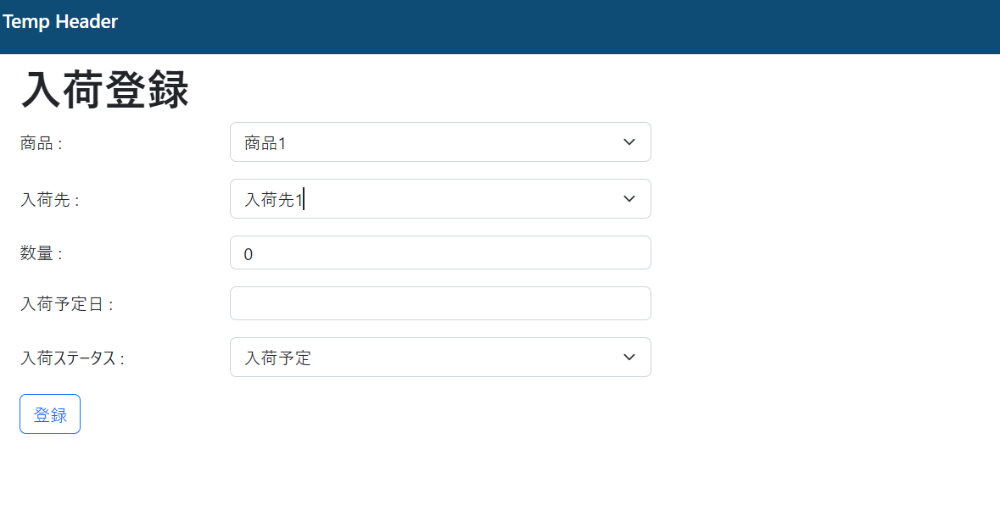

# 課題

入荷情報登録画面作成

## 作成内容

* 入荷情報登録画面を作成して下さい。
  登録画面のURLは`/inbound/create`としてください。
  入力内容
   * 商品
     商品情報のセレクトボックスとしてください。
   * 入荷先情報
     入荷先情報(suppliers)のセレクトボックスとしてください。
   * 数量
     数値入力、1以上としてください。
   * 入荷予定日
     未来日の入力を可能にしてください。現在より前の日付の入力は無効化としてください
     登録時に現在以前の入力があった場合はエラー表示してください。
     予定日の入力には`litepicker`というjsのライブラリを使用し、日付の入力を可能としてください。
   * 入荷ステータス
     入荷予定,入荷済み,出荷予約の3つの選択肢を用意し
     初期登録時入荷予定日が未来日付の場合は入荷予定のみ選択可能とし
     現在以前の日付の場合は3種類選択可能としてください。

view例
