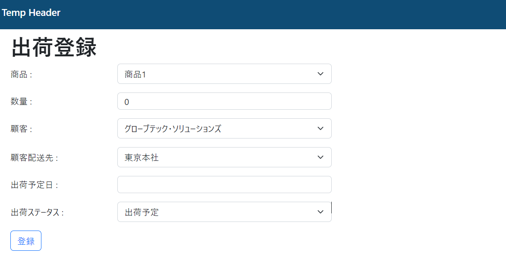

# 課題

出荷情報登録画面作成

## 作成内容

* 出荷情報登録画面を作成してください。
  登録画面のURLは`/outbound/create`としてください。
  入力内容
    * 商品
      商品情報のセレクトボックスとしてください。
    * 数量
      数値入力、1以上としてください。
    * 顧客情報
      顧客情報のセレクトボックスとしてください。
    * 顧客配送先情報
      顧客情報の選択で紐づく顧客配送先情報のセレクトボックスとしてください。
      セレクトボックスでは顧客配送先情報の配送先名を表示してください。
      セレクトボックスの中身は顧客情報の選択が変更されるたびに、紐づく顧客配送先情報に更新してください。
      配送先の情報はControllerにAPIを用意し、都度取得を行い更新するようにしてください。
      APIのエンドポイントは`/outbound/customer/{customerId}/destinations`としてください。
    * 出荷予定日
      未来日の入力を可能とし、現在より前の日付の入力は無効としてください。
      登録処理前にDBを検索し、入荷した在庫を出荷した在庫が上回る場合はエラーにしてください。
    * 出荷ステータス
      出荷予定、出荷済みの2つの選択肢を用意し
      未来日の場合は出荷予定しか選択できないようにしてください。

view例
