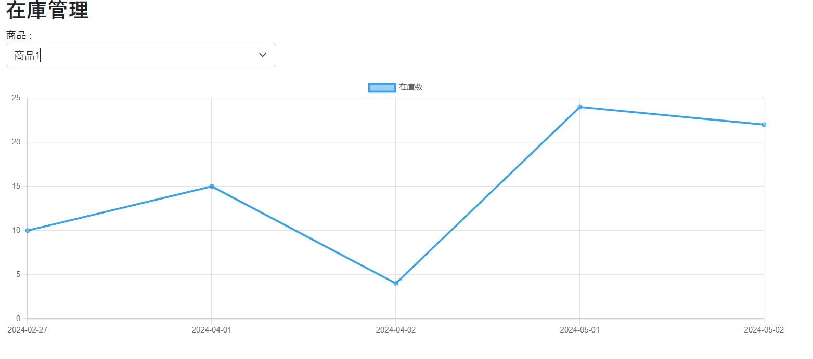

# 課題

在庫管理画面の作成

## 作成内容

在庫管理画面を作ってください。
在庫管理画面のURLは`/inventory`としてください。
`chat.js`のライブラリを使用して入荷された量と出荷される量を計算し在庫量をグラフ化してください。

グラフについて
* 折れ線グラフとしてください。
* グラフの縦軸に在庫の量とし、横軸は日付としてください
* データは日付順にソートを行い、降順に並べてください。
  (古い日付を左とし、新しい日付を右とします)
* データの開始日は画面表示日を基準としてください。
  (開始日までの在庫数は計算を行い、それを初期値としてください)
* 重複した日付のデータの順番は問いません。
  例として4/29の入出荷のデータが複数有った場合、どの順番で表示するかは不定とします
  ただし在庫数はマイナスの表示が起こらないようにしてください。

画面上部に商品のセレクトボックスを用意し、登録された商品についての全量を選択肢として表示を行ってください。
セレクトボックスにて選択された商品の在庫量をグラフで表示してください。
商品ごとの在庫のデータを取得するAPIのURLは`/inventory/{itemId}/data`としてください。

初期表示時は商品IDが有効なものの中で一番若いデータを表示することとしてください。
商品の登録が行われていない場合は、アラートで警告文を表示し、グラフを描画しないようにしてください。

