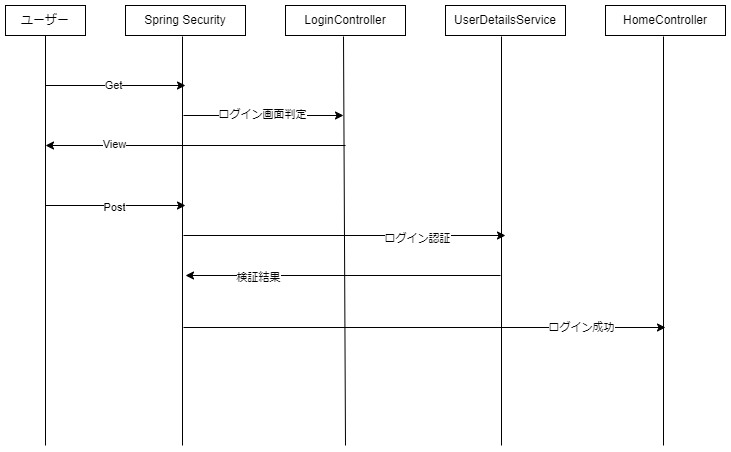
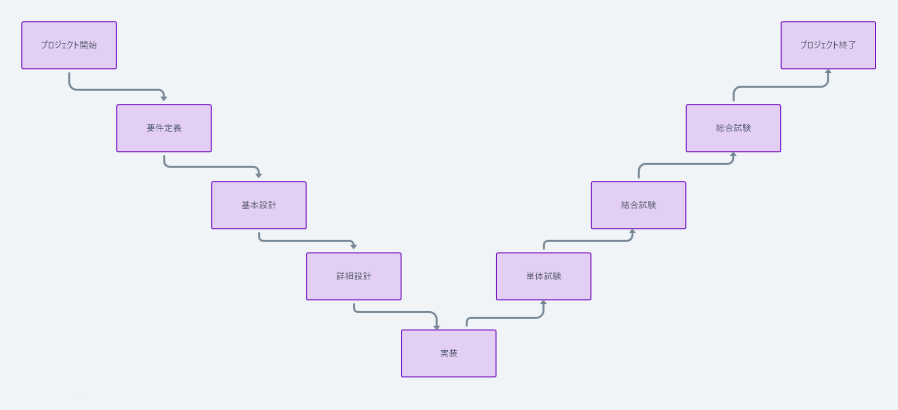

# 研修8日目

## spring FWでの応用

### CustomValidator

Springではバリデーションに`jakarta.validation`という予め用意されていたクラスのアノテーションを使用していました。
それとは別に自分でバリデーションの内容を作る事ができます。

参考ソースとしてユーザーのバリデーションを考えると
郵便番号と電話番号は必須でなくとも`Pattern`のバリデーションによって空が許可されていません。
そのほかルールが2つあり、違反した場合のエラーテキストも2種類でてしまいます。

カスタムバリデーションルールを作ることでこれらを1つにまとめることができます。

参考ソース:`main/java/com/example/demo/lecture/validator`

* カスタムアノテーション

  ```java
  @Constraint(validatedBy = PostalCodeValidator.class)
  @Target({ ElementType.FIELD })
  @Retention(RetentionPolicy.RUNTIME)
  public @interface PostalCode {
    String message() default "{validation.field.postalcode}";
    Class<?>[] groups() default {};
    Class<? extends Payload>[] payload() default {};
  }
  ```

  `@Constraint`で対象となるバリデーションのルールを記載したバリデーターのクラスを指定します

  `@Target`にてアノテーションを付与できる対象を指定します。
  FIELDのほかにMETHODやCLASSもあります。

  `@Retention`にてアノテーションの使用タイミングを決めます。
  バリデーションに使用するアノテーションの場合は`RUNTIME`を指定します。
  どこまで使用するかによって設定する値が異なります。
  コンパイル時まで使用するものだと`SOURCE`などあります。

  その他`@interface`の中の`message`や`groups`等の属性はjava Bean ValidationというAPIの作法に則ったもので
  デフォルトで必要なものと考えてもらって大丈夫です。

* カスタムバリデーター
  
  ```java
  public class PostalCodeValidator implements ConstraintValidator<PostalCode, String>{
  ```
  `ConstraintValidator`を実装し、ジェネリクスで使用するアノテーションとバリデーションを行うデータ型を指定します。

  メソッドは検査を行う`isValid`メソッドを実装し、falseを返却するとバリデーション失敗(エラーとなる)
  trueを返却するとバリデーション成功(何も起きない)となります。

使用するタイミングでは作成したカスタムアノテーションをフォームオブジェクトのフィールドに付与することで使用できます。

```java
@PostalCode
private String postalCode;
```


### ログイン機能

ログイン機能はSpring Securityを利用して実装されます。

ユーザーの認証について`SecurityFilterChain`を返却するメソッドを実装します。

参考ソース:`main/java/com/example/demo/lecture/config/AppSecurity.java`

```java
@Bean
public SecurityFilterChain filterChain(HttpSecurity httpSecurity)
  throws Exception {
  httpSecurity
    .authorizeHttpRequests(authz ->
      authz
        .requestMatchers("css/**", "js/**", "webjars/**")
        .permitAll()
        .requestMatchers("/login")
        .permitAll()
        .anyRequest()
        .authenticated()
    )
    .formLogin(form ->
      form.loginPage("/login").defaultSuccessUrl("/", true)
    )
    .logout(logout -> logout.logoutSuccessUrl("/login?logout"));
  return httpSecurity.build();
}
```

メソッドの引数のHttpSecurityが設定を行うためのオブジェクトです。
`authorizeHttpRequests`にアクセス制御を記載します。

`requestmatchers`で記載されている`css/**`や`js/**`は後続の`permitAll()`によって、認証なしでアクセスが可能であることが書かれています。
同様に`/login`のURLも認証なしでアクセスすることができます。

その他のURLについては`anyRequest`にて認証が必要になっています。(`authenticated`)

`formLogin`によってログインに必要な設定が実装されています。
`form.loginPage`によってログイン時に表示されるURLが設定され`defaultSuccessUrl`によってログインが成功した際の遷移先が設定されています。

ログインの処理自体についてはSpringSecurityが扱うためControllerを作る必要はありません。
ただしログイン画面の表示などビューが関わる部分についてはLoginControllerのようにControllerを作る必要があります。

ユーザーの判定には`UserDetailsService`を実装したクラスが必要です。
参考ソース: `java/main/com/example/demo/lecture/service/CustomUserDetailsService.java`

```java
@Override
public UserDetails loadUserByUsername(String username)
  throws UsernameNotFoundException {
    if (username.equals(appConfig.getUsername())) {
      var encoder = new BCryptPasswordEncoder();
      var pass = encoder.encode(appConfig.getPassword());
      return new User(username, pass, Collections.emptyList());
    }
    throw new UsernameNotFoundException("user not found");
}
```

`UserDetailsService`の`loadUserByUsername`メソッドにて、ログインを行おうとしているユーザーが正しいか検証を行います。
正しい場合はUserDetailsクラスのインスタンスを返却し、正しくない場合は`UsernameNotFoundException`をスローします。

上記では`appConfig`に登録してあるユーザー名と比較しています。





## WEBシステムのセキュリティ対応

### CSRF

CSRFとはログイン済みのサイトに対し、不正な操作を行わせる脆弱性です。
別のサイトに不正にURLを埋め込み、ユーザーに実行させることによって意図しない操作をさせることができます。
例えばECサイトだと、意図しない購入操作等がされます。

対策としては、正規のサイトにランダムな文字列を埋め込み
リクエストの際に同時に送信し、正しい文字列か検証するという方法を使うことが多いです。

一般にランダムな文字列のことをCSRFTokenと呼ばれます。

### XSS

クロスサイトスクリプティングといいます。
WEBシステムなどでユーザーの入力を受け付けますが、受け付けた入力内容にJSを記載され
その内容をそのまま表示してしまうことによって、サイトを開いた別のユーザーのブラウザ上でJSが実行されてしまう脆弱性です。

実行されるJSによってはログイン情報(セッションなど)や、サイト上での操作等を自由に出来てしまうため
WEBシステムでは必ずユーザーの入力についてはJS等が実行できないようにエスケープする必要があります。

エスケープ処理を入力処理のサニタイジングといい、現在ではほぼフレームワークが自動で行ってくれます。
ただサニタイジングを意図的に外した実装も可能なので、脆弱性が発生しないように実装する必要があります。

### SQLインジェクション

こちらもWEBシステムで入力を受け付けた際、受け付けた入力にSQLを記載され
その内容をそのまま実行してしまうことによって、システム内のDBの情報を盗まれてしまう脆弱性です。

ログイン処理などでユーザーの入力をDBで検索する際などにはサニタイジングを忘れず
実装するようにしましょう。

こちらも現在は主にフレームワークが自動でサニタイズしてくれますが、サニタイズされない実装方法などもあるため
必ず調査したうえで実装することが重要です。


## システム開発について

現在手法としてはウォーターフォールやアジャイルなどといった手段を用いて開発が進みます。
良く行われているのはウォーターフォール型開発です。

### ウォーターフォール型開発とは

ウォーターフォールとソフトウェア開発プロセスの一つで、その名の通り「滝」のように段階を追って下降していく開発手法を指します。
このモデルは、一連の段階を順序だてて進めていくことが特徴で
各段階は一つ完了してから次に進むため、前段階の工程が終了させてから次の工程へ進みます。
次の工程へ進んだ場合は基本的に前段階の工程には戻りません。




### アジャイル型開発とは

アジャイル(スクラム)とはウォーターフォールの様に工程を区切らず、スプリントと呼ばれる短い期間に開発作業を区切り
作業していくソフトウェア開発プロセスです。

スプリントは通常1~2週間程度で、その間に設計、開発、試験を行います。
細かく開発をすすめることでリリースまでの時間を減らし価値の提供を早め
要件への変更などにも柔軟に対応できるようにします。

スプリントごとの作業量を平均してベロシティと呼びます。
ベロシティを測定し、スプリントで開発できる機能量を制限します。

## 設計について

以降はウォーターフォール型での開発の工程の説明です。

### 要件定義

要件定義とは、主に発注者側の要望をまとめ、開発するシステムが実現しないといけない具体的な機能や条件を明確にし
関係者間で合意を取ることです。

基本的に発注者側が業務上必要とされる事について、受注者側がヒアリングを行います。
行った結果を成果物としてまとめ、工程を完了とします。

要件定義では「要件定義書」を作ります。
定義書には「機能一覧」や「非機能要件一覧」が載せられることが多いです。

機能一覧には名前の通りシステム上必要とされる機能がまとめられます。
発注者側には、システム開発を管理するプロジェクトマネージャーとシステムを使う人がいます
その両方の要望に対し、齟齬や汲み取り漏れがないか考える必要があります。

「要件定義書」には、以下のようなものが記載されることが多いです。

* 概要
  プロジェクトの目的や背景、範囲を説明します。

* 機能要件
  システムが提供する具体的な機能やサービスを詳細に記述します
  ユーザーがシステムを通じて実行できる具体的な機能や、システムが自動的に行う処理が含まれます。
  機能は一覧化されることが多いです。

* 非機能要件
  システムの性能基準やセキュリティ要件、など、機能以外の要素に関する要件を定義します。
  こちらも一覧化されていることが多いです。

* データ要件
  システムで扱うデータの種類、形式、量などに関する要件を定義します。
  非機能要件に含まれます。

* 承認基準
  システムが要件を満たしているかを判断するための基準や方法を定義します。
  検収の際の流れなどについて合意するための文書です。


### 基本設計

基本設計は要件定義の成果を基にシステムの全体的な構造と機能を設計します。
この工程の主な目的はシステムの主要なプログラムの流れや詳しいデータ構造などを定義することです。

基本設計の成果物としては「基本設計書」で下記のような内容が記載されていることが多いです。

* システムアーキテクチャ
  システムの全体的な構造を示します。
  データフローやプロセスフローが含まれることが多いです。

* データモデル
  システムが扱うデータの構造を定義します。
  データベースのスキーマ設計、データの型やリレーションを指します。

* UIの設計
  システムのユーザーインターフェースに関する概念設計、画面レイアウトなどの基本的な設計を含みます。

* 機能設計
  各機能の動作や、システムの各部分がどのように連携して機能するかについて記述します。

* 技術スタックと環境
  使用する技術スタック(プログラミング言語、フレームワーク、データベースシステムなど)と
  開発・テスト・本番環境に関する情報を決めます。


### 詳細設計

詳細設計は基本設計で決定されたUIなどを具体化し、実際の実装に必要な詳細な設計をします。
詳細設計の目的は、製造するために必要な情報を予め先に決めておくことになります。

詳細設計の主な成果物は「詳細設計書」で下記のような内容が記載されていることが多いです

* データベース設計
  データベースのさらに詳細なスキーマ設計、テーブル定義、インデックス設計、リレーションシップ、制約条件などを定義します。

* ユーザーインターフェースの詳細設計
  画面設計の詳細を具体的に定義します。

* 異常系設計
  エラーや例外が発生した際の処理方法、ロギングの仕様などを定義します。

* クラス設計
  システムを構成する各クラスなどの内部設計を詳細に記述します。
  これにはメソッドの仕様、オブジェクト間の相互作用などが含まれます。
