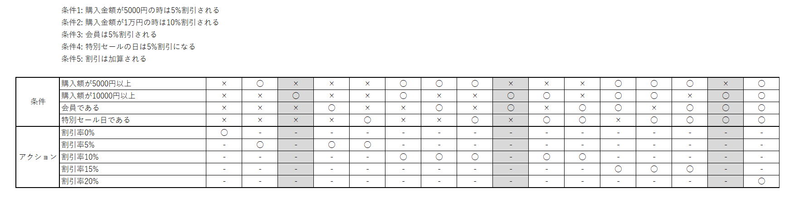
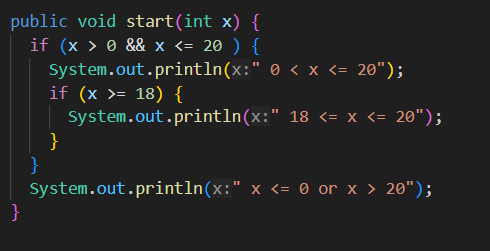
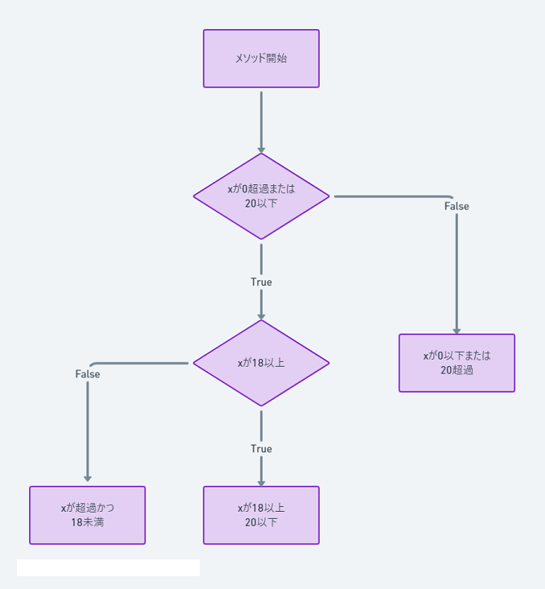

# 研修9日目

## 試験の種類について

* 単体試験とは
  実装されたメソッド、画面などが正しく機能するか確認するテストです。
  プログラム単体での動作を担保することを目的としています。
  
* 結合試験とは
  プログラム間の連携した動作を担保することを目的としたテストです。
  主に複数の画面間での不具合が起きないかを確認します。

* 総合試験とは
  作成したシステムが要件定義の通り動作するか担保することを目的としたテストです。
  ユーザーの操作を想定したシナリオテストなどもあります。

## 単体試験
  
  単体試験には実施方法として2種類あります。

* ブラックボックステスト

  アプリケーションの内部構造や動作原理に焦点を当てずに、外部から見える振る舞いや機能を検証する手法です。
  この手法ではプログラムの入出力のみが考慮され、内部のコードは考慮しません。
  テスターはアプリケーションの内部を見ずに、外部から入力を与えて出力を観察し期待される結果が得られるかどうかを確認します。

* ホワイトボックステスト

  ホワイトボックステストはソフトウェアの内部構造、コードのロジックに重点を置いて実施されるテスト方法です。
  この方法ではテスターがソフトウェアのソースコードを詳細に理解し、それに基づいてテストケースを作成します。
  この手法では内部コードの各部分が期待通りに機能するかどうかを検証し、コードのロジックに隠れた欠陥やエラーがないかを特定することです。
  コードを確認しテストケース作成するため、高いコードカバレッジを達成することが可能です。

  ※コードカバレッジとは
  ホワイトボックステストを行った際に、テストの動作時にどれだけのコードを実行したかという指標です。

### ブラックボックスの試験観点

ブラックボックステストでは単体試験仕様書の作成を行います。
その際には抜けや漏れがないようにテストケースの作成を行います。
テストケースを作る際には下記のような試験観点に気を付けて抜け漏れがないように設計します。

* 同値分割
  主に入力データを意味のある区分に分割し、それぞれの区分から代表的な値を選んでテストを行う方法です。
  代表的な値を選ぶことによって、全ての値をテストするよりも少ない工数でテストを実施できます。
  たとえばある関数が0から100までの整数を受け入れる場合、0から100までのすべての値でテストを行うのは非常に時間がかかります。
  分割値法ではこの入力範囲をより小さな区分に分割し、各区分から特定の値(通常は区分の境界値や中央値など)を選んでテストします。

  区分は動作が異なる範囲から選択されます。
  例えばあるアプリケーションが成人とそれ以外のユーザーに対して異なる動作をする場合
  年齢を2つの区分(0-17歳、18歳以上)に分割しそれぞれの区分からテストケースを生成します。

* 境界値
  特に入力値の範囲や条件の境界付近での挙動を検証することに焦点を当てたテスト手法です。
  この手法の基本的な考え方としては、ソフトウェアのバグや問題は入力値や条件の境界付近で発生する傾向があるというものです。
  (>と>=の間違いは基本的ですが、慣れていても間違う事のある代表例のようなバグです。)
  したがって、これらの境界値を重点的にテストすることで効率的にバグを特定し解決することができます。


* ディシジョンテーブル
  デシジョンテーブルは、ソフトウェアテストやシステム分析において複雑なビジネスロジックを簡潔に表現するために使用されます。
  ディシジョンテーブルは異なる条件の組み合わせが与えられた場合にシステムが取るべき行動や反応を整理し、可視化することができます。
  主にビジネスプロセスやシステムの挙動が多くのルールよって決定される場合に適しています。

  

  (上記では○と×、-を使用していますが、YとN,N/Aを使用することがあります。)

  デシジョンテーブルの構成は、基本的に二部構成であり、上部(左部)には「条件」が、下部(右部)には「アクション」が記載されます。
  条件部分は特定のルールに関連する要素を含み、これらの要素の異なる状態や値が列挙されます。
  アクション部分は、それぞれの条件の組み合わせに対してシステムの動作を表しています。
  表の各列は「ルール」として機能し、特定の条件の組み合わせに対するアクションを定義します。


## テストカバレッジについて

ホワイトボックステストではコードを念頭においた状態で、テストケースの作成を行います
その際には作成されたコードの中がどれだけ実行されたかをテストケースの網羅性の指標にします。
網羅性はカバレッジといって下記の様な基準があります。





* C0(命令網羅)
  一般的にメソッドが少なくとも1回は実行されることを担保します。
  メソッドが実行されていることを確認します。
  メソッド内の処理については考慮しません。

* C1(分岐網羅)
  メソッド内部の分岐について1回は実行されることを担保します。
  メソッド内のif文内の内どちらか一方の条件が実行されていることを確認します。
  その他の条件については考慮しません。

* C2(条件網羅)
  メソッド内部の分岐の全てについて1回は実行されることを担保します。
  メソッド内の処理について全て実行されていることを確認します。
  実行されていないコードがないようにします。

## 自動化テストについて

### JUnitについて

Java用の単体テスト用のフレームワークです。
自ら作成したコードに対して、動作を担保するコードを書きます。
コードを実行することで、同じテストを何度も出来るようにします。

* テストアサーション
  テストすることに対して、「アサーション」といいます。
  テストする場合基本的には入力値(引数)と出力値(戻り値)の確認を行います。

  * assertEquals(expected, actual)
    期待値と実際の値が等しいかをテストします。

    ```java
    @Test
    void testEqual() {
      int expected = 1;
      // テスト対象のインスタンス(targetInstance)のテストするメソッド(testMethod)を呼び出して
      // 動作が一致するか確認する
      int actual = targetInstance.testMethod(); 
      Assertions.assertEquals(expected, actual);
    }
    ```

  * assertNotEquals(expected, actual)
    期待値と実際の値が異なることをテストします。

    ```java
    @Test
    void testNotEqual() {
      int expected = 1;
      int actual = targetInstance.testMethod(); 
      Assertions.assertNotEquals(expected, actual);
    }
    ```

  * assertTrue(condition)
    条件がtrueであることをテストします。

    ```java
    @Test
    void testTrue() {
      boolean actual = targetInstance.testMethod(); 
      Assertions.assertTrue(actual);
    }
    ```

  * assertFalse(condition)
    条件がfalseであることをテストします。

    ```java
    @Test
    void testFalse() {
      boolean actual = targetInstance.testMethod(); 
      Assertions.assertFalse(actual);
    }
    ```

  * assertNull(object)
    オブジェクトがnullであることをテストします。

    ```java
    @Test
    void testNull() {
      Object actual = targetInstance.testMethod(); 
      Assertions.assertNull(actual);
    }
    ```

  * assertNotNull(object)
    オブジェクトがnullでないことをテストします。

    ```java
    @Test
    void testNotNull() {
      Object actual = targetInstance.testMethod(); 
      Assertions.assertNotNull(actual);
    }
    ```

* テスト準備
  テストを実行する前に、実行するためのインスタンスや状態を準備します。
  アノテーションにてメソッドを定義します。

  * `@BeforeAll`
    テストクラスの実行時に、一度だけテストケースの実行前に実行されます。

  * `@BeforeEach`
    テストケースの実行前に必ず実行されます。

  テストによっては、後のテストに影響しないようにテスト実行後にクリーンアップを行う場合などもあります。

  * `@AfterEach`
    テストケースの実行後に必ず実行されます。

  * `@AfterAll`
    テストクラスの実行時に、全てのテストケースの実行が終った後、1度だけ実行されます。

  ```java
  import org.junit.jupiter.api.*;

  public class SampleTest {

    @BeforeAll
    static void setup() {
      // 全テストの前の初期化処理
      System.out.println("Before all")
    }

    @BeforeEach
    void init() {
      // 各テストの前の初期化処理
      System.out.println("Before each")
    }

    @Test
    void testCase() {
      // テストケース
      Assertions.assertEquals(1, 1);
    }

    @AfterEach
    void tearDown() {
      // 各テストの後のクリーンアップ処理
      System.out.println("After Each")
    }

    @AfterAll
    static void done() {
      // 全テストの後のクリーンアップ処理
      System.out.println("After all")
    }
  }
  ```

### テストスタブ(Mockito)

  自動化テストは単体試験レベルのテストになるため
  同じテストを実行した場合必ず同じ結果になるように作成を行います。

  テスト対象について、メソッド内で別のクラス等を呼び出ししている場合
  別クラスのふるまいがメソッドの実行結果に影響を与える可能性があります
  そういった場合、外部オブジェクトの呼び出しをスタブしてテストを行います。

  スタブは専用のライブラリ(Mockito)や手動で作成したクラスで行います。
  スタブは実際のインスタンスの代わりに特定の入力に対して事前に設定したレスポンスを返却するようになっています。
  そうすることによって、外部のクラスのインスタンスに依存することなく対象のクラスをテストすることができます。

  スタブされたオブジェクトをMockオブジェクトと言うこともあります。
  スタブとモックに関してはほぼ同じものを指しています。

  通常SpringBootではDIを使って別クラスのインスタンスを使用しますが、DIによって注入されるオブジェクトを変更することでスタブ用のクラスを使用するようにできます。

  テスト対象例
  ```java
  public class SampleController {
    @Autowired
    SampleService sampleService;

    public String method(Model model) {
      List<SampleEntity> samples = sampleService.findAll();
      model.addAttribute("samples", samples);
      return "pages/test/sample";
    }

    public String method2(Model model,Long id) {
      var sample = sampleService.findOne(id);
      model.addAttribute("sample", sample);
      return "pages/test/sample2";
    }
  } 
  ```

* オブジェクトをスタブし、元のメソッドの戻り値をテストする

  ```java
  // @Mockや@InjectMocksを使うために宣言が必要
  @ExtendWith(MockitoExtension.class)
  public class SampleControllerTests {

    @Mock
    private SampleService sampleService;

    @Mock
    private Model arg;

    @InjectMocks
    private SampleController sampleController; 


    @Test
    public void methodTest() {
      String result = sampleController.method(arg);
      assertEquals("pages/test/sample", result);
    }
  }
  ```

* スタブしたオブジェクトが呼ばれているかテストする

  ```java
  @Mock
  private SampleService sampleService;

  @Mock
  private Model arg;

  @InjectMocks
  private SampleController sampleController; 

  @Test
  public void mockTest() {
    var lists = new ArrayList<SampleEntity>();
    // sampleServiceのfindAllメソッドが呼ばれた場合にreturnする値を登録
    Mockito.doReturn(lists).when(sampleService).findAll();

    sampleController.method(arg);

    // sampleServiceが1回で呼ばれている。
    Mockito.verify(sampleService, Mockito.times(1)).findAll();
  }
  ```

* スタブしたオブジェクトの引数をテストする

  ```java

  @Mock
  private SampleService sampleService;

  @Mock
  private Model arg;

  @InjectMocks
  private SampleController sampleController; 

  // ジェネリクスではキャプチャする引数の肩を指定する
  @Captor
  private ArgumentCaptor<Long> argumentCaptor;

  @Test
  public void argTest() {
    // argumentCaptorオブジェクトにて引数のキャプチャができる
    Mockito.when(sampleService.findOne(argumentCaptor.capture())).thenReturn(new SampleEntity());
    sampleController.method2(arg, 1L);

    // argumentCaptorのメソッドでキャプチャした引数の取得ができる
    assertEquals(1L, argumentCaptor.getValue());
  }
  ```
